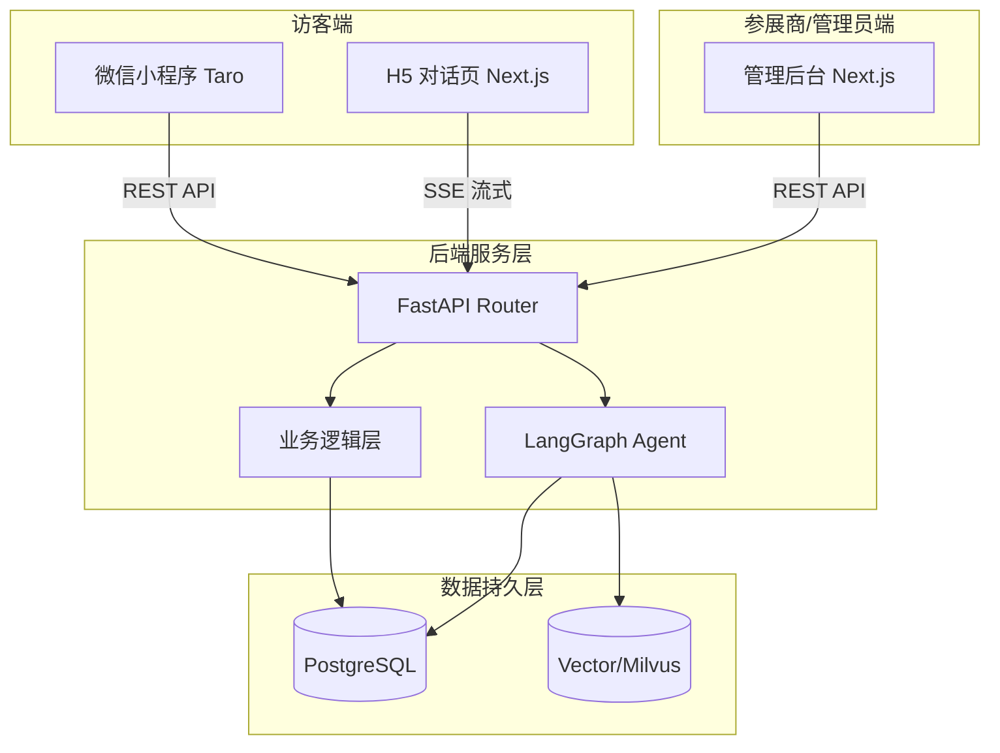

# 系统架构设计 (System Architecture)

> 展会智能 Agent 平台的顶层架构设计文档，用于指导全栈开发过程中的系统交互和边界划分。

## 1. 业务愿景
平台旨在为展会参展商提供一键生成“智能对话 Agent”的能力。参展商提供展会信息（可抓取），AI 平台自动分析内容，生成包含知识库和特定设定的专属 Agent。访客通过微信小程序或 H5（Chat）与该 Agent 进行对话，了解展会信息或产品详情。

## 2. 整体架构拓扑

## 3. 核心包 (Monorepo) 职责定义

1. **`pkgs/server` (FastAPI + LangGraph + PostgreSQL)**
   - **核心地位**：整个系统的中枢大脑。
   - **职责**：
     - 提供 REST API 供 Admin 和 App 调用。
     - 提供 SSE (Server-Sent Events) 接口供 Chat 端进行流式大模型对话。
     - LangGraph 构建 Agent 工作流（抓取展会内容 -> 总结 -> 构建系统提示词 -> 对话）。
     - 通过 SQLAlchemy 和 asyncpg 与数据库进行异步交互。

2. **`pkgs/app` (Taro + React 18)**
   - **职责**：提供给普通用户（访客或地推人员）的移动端入口。主要功能包含展会列表浏览、简单的 Agent 交互跳转以及个人中心。

3. **`pkgs/chat` (Next.js 16)**
   - **职责**：极其轻量、专注对话的沉浸式 C 端 H5 页面。
   - **技术特点**：利用 React 19 / Next.js 的服务端组件和 `ai` SDK 等处理 SSE 流式对话，要求极致的首屏速度和动画流畅度。

4. **`pkgs/admin` (Next.js 16 + shadcn/ui)**
   - **职责**：参展商和平台运营人员的 B 端管理后台。管理展会信息、Agent 配置、系统 Prompt 微调和对话日志分析。

## 4. 关键技术选型考量
- **Python + FastAPI**：因为涉及到大量 LangChain 和 LangGraph 的使用，Python 是 AI 编排的最优语言。FastAPI 支持异步，能很好应对并发请求。
- **Monorepo**：前端虽有不同的端（Taro, Next.js），但经常共享类型定义和 UI 设计规范。未来可增加 `pkgs/shared` 共享 TS 类型。